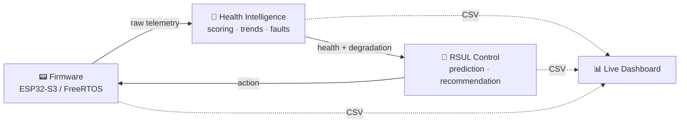
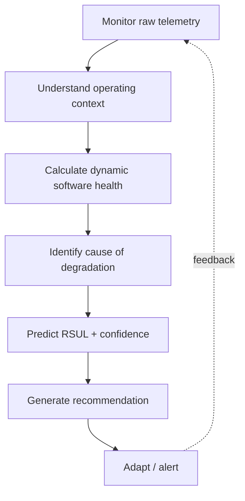
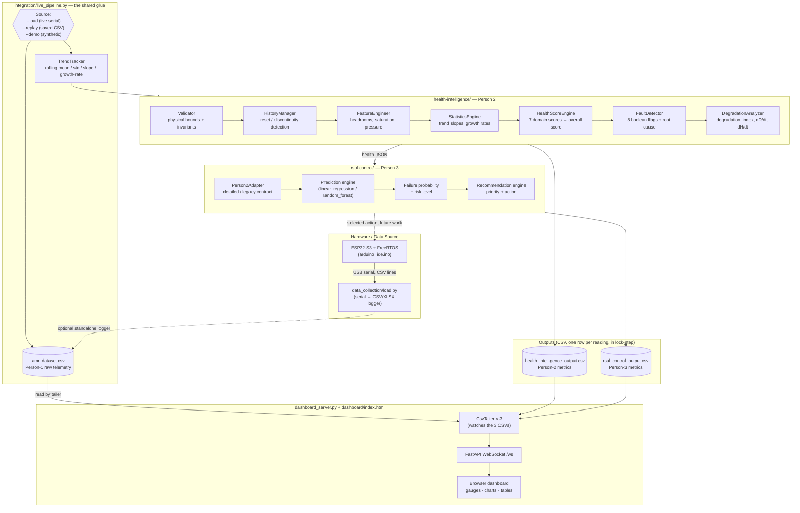
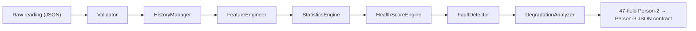
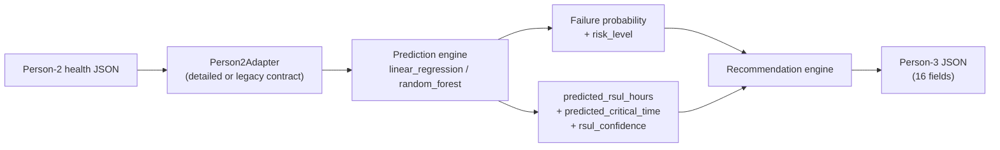
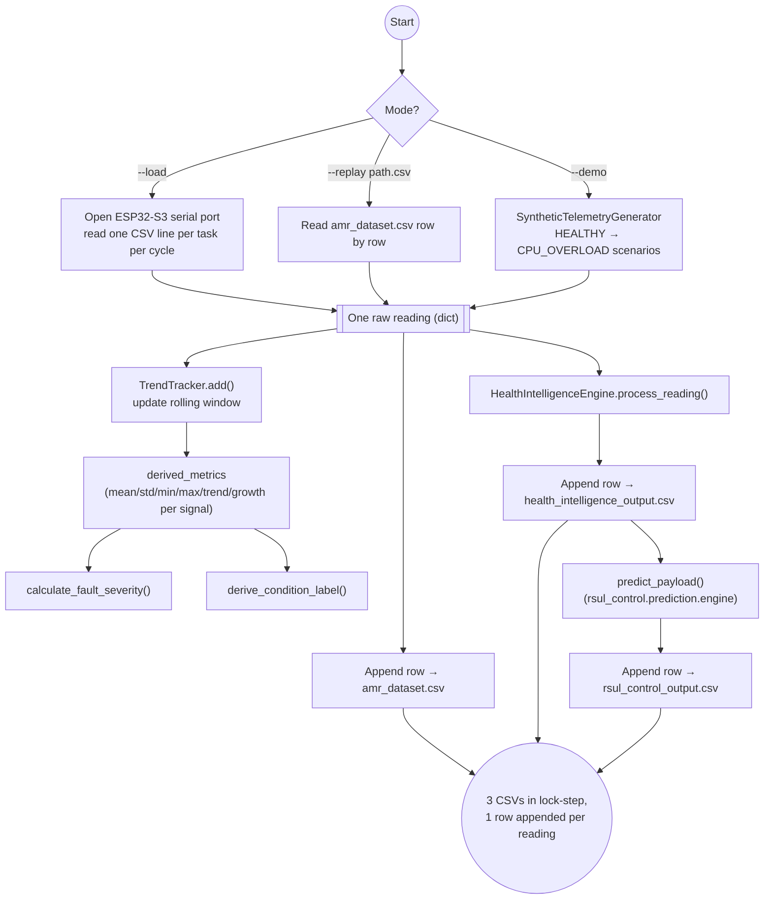
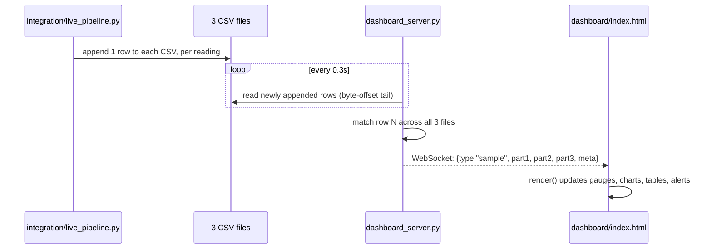
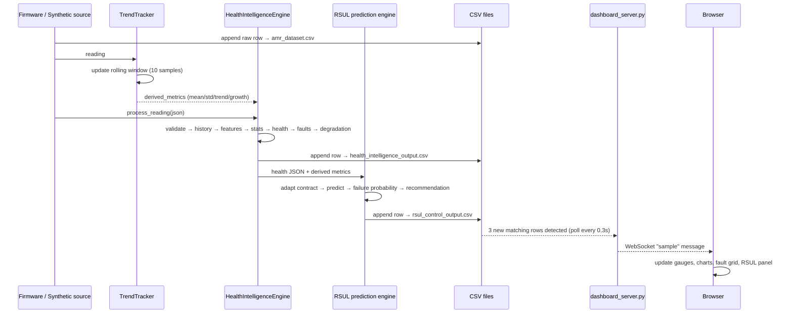

# PulseOS

**Predictive runtime software health, RSUL estimation, and a live web dashboard for RTOS-based Edge‑AI systems.**

PulseOS gives an embedded Edge‑AI device (an ESP32‑S3 running FreeRTOS) a
*pulse*: it continuously senses its own runtime health, turns dozens of raw
telemetry signals into a single explainable health score, figures out *why*
that score is changing, predicts how much reliable operating time is left
(the **RSUL** — Remaining Software Useful Life), and streams all of it to a
live browser dashboard in real time.



---

## Table of contents

- [PulseOS](#pulseos)
  - [Table of contents](#table-of-contents)
  - [Why PulseOS](#why-pulseos)
    - [Core concept](#core-concept)
  - [End‑to‑end architecture](#endtoend-architecture)
  - [Repository layout](#repository-layout)
  - [The three subsystems](#the-three-subsystems)
    - [1. Data collection / Firmware (Person 1)](#1-data-collection--firmware-person-1)
    - [2. Health Intelligence (Person 2)](#2-health-intelligence-person-2)
    - [3. RSUL Control (Person 3)](#3-rsul-control-person-3)
  - [The integration layer](#the-integration-layer)
  - [The live dashboard](#the-live-dashboard)
  - [Data contracts — every metric explained](#data-contracts--every-metric-explained)
    - [Person 1 → Person 2 (`amr_dataset.csv`, 48 fields)](#person-1--person-2-amr_datasetcsv-48-fields)
    - [Person 2 → Person 3 (`health_intelligence_output.csv`, 47‑field locked contract)](#person-2--person-3-health_intelligence_outputcsv-47field-locked-contract)
    - [Person 3 output (`rsul_control_output.csv`)](#person-3-output-rsul_control_outputcsv)
  - [Sequence diagram — one reading, start to finish](#sequence-diagram--one-reading-start-to-finish)
  - [Getting started](#getting-started)
  - [Running the whole system](#running-the-whole-system)
  - [Tech stack](#tech-stack)
  - [Known issue already fixed](#known-issue-already-fixed)
  - [Roadmap \& evaluation](#roadmap--evaluation)
  - [Research \& patent notes](#research--patent-notes)
  - [License](#license)

---

## Why PulseOS

Most embedded monitoring stops at a dashboard: CPU, memory, a few graphs.
That tells you what already happened. PulseOS instead:

- Learns what *normal* looks like for whatever the device is currently
  doing, so a busy‑but‑healthy device isn't confused with a failing one.
- Converts ~40 raw metrics into one dynamic, context‑aware **health score**.
- Explains **why** health is dropping (root‑cause fault detection), not
  just that it is.
- Predicts **remaining useful operating time**, with an explicit
  confidence/risk level.
- Produces a concrete, prioritized **recommendation** ("optimize the AI
  model", "reduce inference frequency", etc.).
- Shows all of it live, in a browser, updating every second.

### Core concept



---

## End‑to‑end architecture

Three independently‑owned subsystems talk to each other through **strict,
versioned CSV/JSON contracts** — never through shared internal state. That
is what makes it possible to swap the data source (real hardware, a
replayed CSV, or fully synthetic data) without touching a single line of
the scoring or prediction logic, and without touching the dashboard at all.



Data flows **one way** around the loop (firmware → health → RSUL), and in
the current implementation the selected recommendation is surfaced to the
operator on the dashboard rather than being written back to the firmware
automatically — that closed‑loop actuation is the "adapt RTOS" step called
out in the roadmap below.

---

## Repository layout

```
PulseOS-main/
├── README.md                        ← you are here
├── DASHBOARD_README.md              ← focused setup guide for the live dashboard
├── LICENSE
├── arduino_ide.ino                  ← ESP32‑S3 / FreeRTOS firmware (Person 1)
│
├── data_collection/                 ← Person 1 companion tool
│   └── load.py                      ← standalone serial → CSV/XLSX logger
│
├── health-intelligence/             ← Person 2
│   ├── requirements.txt
│   ├── health_engine/
│   │   ├── engine.py                ← HealthIntelligenceEngine (stream coordinator)
│   │   ├── config.py                ← calibration parameters
│   │   ├── validator.py             ← input validation & cleaning
│   │   ├── history.py               ← rolling history + reset detection
│   │   ├── features.py              ← derived feature engineering
│   │   ├── statistics.py            ← trend slopes & growth rates
│   │   ├── health.py                ← 7‑domain health scoring
│   │   ├── faults.py                ← fault flags & root‑cause ranking
│   │   ├── degradation.py           ← degradation index & health states
│   │   ├── diagnostics.py           ← human‑readable explanations
│   │   └── synthetic.py             ← synthetic telemetry generator (demo mode)
│   ├── examples/, tests/, docs/
│
├── rsul-control/                    ← Person 3
│   ├── requirements.txt
│   ├── src/rsul_control/
│   │   ├── adapter/                 ← Person‑2 → Person‑3 contract adapter
│   │   ├── prediction/              ← ML prediction engine (LR / Random Forest)
│   │   └── api/main.py              ← FastAPI service (POST /predict)
│   ├── src/rsul/                    ← RSUL model, failure probability, recommendations
│   ├── train.py / predict.py / evaluate.py / check_model.py
│   ├── dashboard/streamlit_app.py   ← optional Streamlit analyst view
│   ├── models/, data/, results/
│
├── integration/                     ← shared glue between all three subsystems
│   ├── live_pipeline.py             ← the closed‑loop runner (live / replay / demo)
│   └── backfill_rsul.py
│
├── dashboard/                       ← the live web dashboard (frontend)
│   └── index.html
│
├── dashboard_server.py              ← WebSocket bridge: CSVs → browser, in real time
├── dashboard_requirements.txt
│
└── docs/
    └── interfaces/                  ← versioned JSON schemas + CHANGELOG.md
```

---

## The three subsystems

### 1. Data collection / Firmware (Person 1)

**Question it answers:** *What is actually happening inside the device
right now?*

- **`arduino_ide.ino`** — FreeRTOS firmware for an ESP32‑S3. Runs the
  sensing/AI‑inference/comms tasks, measures its own CPU, heap, stack,
  scheduler, queue, interrupt, power and thermal behaviour every cycle, and
  prints one CSV line per task per cycle over USB serial.
- **`data_collection/load.py`** — a standalone logger: auto‑detects the
  ESP32‑S3's serial port, reads its CSV stream, and appends it to
  `amr_dataset.csv` (refreshing an `.xlsx` copy periodically). Useful if
  you just want to *capture* a dataset without running the rest of the
  pipeline live.
- Emits **48 raw telemetry fields** per reading (CPU, memory/heap, stack,
  task scheduling, AI inference timing, message queues, interrupts, power,
  temperature, and reset counters) — see the [metrics reference](#data-contracts--every-metric-explained) below.

### 2. Health Intelligence (Person 2)

**Question it answers:** *How healthy is the software, how is that health
changing, and what's causing any degradation?*

Package: `health-intelligence/health_engine/`. The `HealthIntelligenceEngine`
is a **stateful stream processor** — `process_reading(json) -> json` — built
as a strict pipeline of single‑responsibility stages:



| Stage            | Responsibility                                                                                                                                                                                        |
| ---------------- | ----------------------------------------------------------------------------------------------------------------------------------------------------------------------------------------------------- |
| `validator.py`   | Enforces physical boundaries and mathematical invariants; distinguishes "missing" from "observed zero"; derives values deterministically where justified.                                             |
| `history.py`     | Maintains rolling time‑indexed history; detects device reboots and counter discontinuities and resets baselines accordingly.                                                                          |
| `features.py`    | Computes derived internal signals — headroom, saturation ratios, scheduling pressure — without duplicating/correlating existing metrics.                                                              |
| `statistics.py`  | Rolling‑window statistics, OLS regression trend slopes, and normalized growth rates, with careful handling of insufficient history.                                                                   |
| `health.py`      | Produces 7 normalized 0–100 domain health scores (CPU, memory, stack, task, timing, AI, resource) and combines them into `overall_health_score` using context‑aware weights and a bottleneck penalty. |
| `faults.py`      | Evaluates 8 boolean fault flags, ranks root causes across 11 internal diagnostic categories, and computes fault severity/count.                                                                       |
| `degradation.py` | Computes `degradation_index` (0–1), `degradation_rate` (dD/dt), `health_change_rate` (dH/dt), and classifies the system into one of 5 health states.                                                  |
| `diagnostics.py` | Produces human‑readable, mathematically‑justified explanations for any metric, without polluting the production contract.                                                                             |
| `synthetic.py`   | Generates realistic synthetic telemetry scenarios (`HEALTHY`, `CPU_OVERLOAD`, …) — this is what powers `--demo` mode, so the whole pipeline can be exercised with **no hardware at all**.             |

Output: the exact **47‑field Person‑2 → Person‑3 contract** defined in
`docs/interfaces/person2_to_person3.schema.json` (health scores, trends,
fault flags, degradation metrics).

### 3. RSUL Control (Person 3)

**Question it answers:** *How much reliable operation remains, and what
should be done about it right now?*

Package: `rsul-control/src/rsul_control/` (+ `rsul-control/src/rsul/`).



- **`adapter/person2_adapter.py`** accepts *either* the detailed 47‑field
  contract, or a compact legacy PulseOS contract (`shi`, `health_state`,
  `degradation_rate`, …) — it never fabricates telemetry the legacy
  contract doesn't actually provide.
- **`prediction/engine.py`** runs the trained ML model (`train.py` trains
  it against `data/synthetic/person2_dummy_training_2000.csv`) to project
  current health forward, estimate a failure probability, and compute a
  remaining‑useful‑life estimate with an explicit confidence.
- **`rsul/failure_probability.py`**, **`rsul/rsul_model.py`**,
  **`rsul/recommendations.py`**, **`rsul/explainability.py`** implement the
  underlying failure‑probability model, the RSUL‑hours estimator, the
  recommendation/priority logic, and the dominant‑factor explainability
  (which health dimension is driving the degradation).
- **`api/main.py`** exposes this as a FastAPI service (`POST /predict`) for
  ad‑hoc / external integration, independent of the live pipeline.
- **`dashboard/streamlit_app.py`** is an optional analyst‑facing Streamlit
  view, separate from the live web dashboard described below.

---

## The integration layer

**`integration/live_pipeline.py`** is the shared glue that actually wires
Person 1 → Person 2 → Person 3 together and is the only thing you need to
run to exercise the whole system:



Three execution modes, all producing the **same three CSVs**, which is what
lets the dashboard stay completely agnostic to where the data came from:

| Mode   | Flag                       | Requires hardware?      | Use case                                   |
| ------ | -------------------------- | ----------------------- | ------------------------------------------ |
| Live   | `--load {low,normal,high}` | Yes — ESP32‑S3 over USB | Real device                                |
| Replay | `--replay <file.csv>`      | No                      | Re‑run a previously captured dataset       |
| Demo   | `--demo`                   | No                      | Synthetic telemetry — good for testing/dev |

---

## The live dashboard



`dashboard_server.py` is a small FastAPI app that:

1. Serves `dashboard/index.html` at `/`.
2. Tails `amr_dataset.csv`, `health_intelligence_output.csv` and
   `rsul_control_output.csv` (read‑only, incrementally, by byte offset —
   safe against a file another process is actively appending to).
3. Waits until a matching row has landed in all three, bundles them into
   one JSON message, and broadcasts it to every connected browser over
   `ws://.../ws`.

The frontend (`dashboard/index.html`) needs no changes to consume this —
its `render(msg)` function already expects exactly this
`{part1, part2, part3, meta}` shape, with health gauges, rolling charts,
a fault matrix, and the predictive RSUL/failure/recommendation panel.

See **[DASHBOARD_README.md](DASHBOARD_README.md)** for the step‑by‑step
run guide.

---

## Data contracts — every metric explained

Every handoff between subsystems is a versioned schema
(`docs/interfaces/`). Fields are grouped by which CSV/JSON they appear in.

### Person 1 → Person 2 (`amr_dataset.csv`, 48 fields)

| Group                 | Fields                                                                                                                                     |
| --------------------- | ------------------------------------------------------------------------------------------------------------------------------------------ |
| Core                  | `timestamp`, `sample_id`, `uptime_ms`, `scenario_id`                                                                                       |
| CPU                   | `cpu_utilization`, `cpu_idle`, `task_cpu_utilization`                                                                                      |
| Memory / heap         | `total_heap`, `free_heap`, `used_heap`, `heap_utilization`, `minimum_free_heap`, `heap_churn_bytes`, `heap_alloc_failures`                 |
| Stack                 | `stack_high_water_mark`, `stack_utilization`                                                                                               |
| Task                  | `task_name`, `task_priority`, `task_state`, `task_execution_time`, `task_period`, `task_jitter`, `task_execution_count`, `deadline_misses` |
| Scheduler             | `context_switches`, `task_switches`, `scheduler_delay`, `active_task_count`                                                                |
| AI inference          | `inference_time`, `min_inference_time`, `max_inference_time`, `average_inference_time`, `inference_count`, `inference_frequency`           |
| Queue                 | `queue_length`, `queue_capacity`, `queue_utilization`                                                                                      |
| Messaging             | `messages_sent`, `messages_received`, `dropped_messages`                                                                                   |
| Interrupts            | `interrupt_count`, `interrupt_latency`                                                                                                     |
| Power / thermal       | `power_consumption`, `system_temperature`                                                                                                  |
| Reliability           | `watchdog_resets`, `system_resets`                                                                                                         |
| Sensor (app‑specific) | `distance_cm`, `ultrasonic_timeouts`                                                                                                       |

### Person 2 → Person 3 (`health_intelligence_output.csv`, 47‑field locked contract)

| Group                 | Fields                                                                                                                                                                          |
| --------------------- | ------------------------------------------------------------------------------------------------------------------------------------------------------------------------------- |
| CPU trend stats       | `cpu_mean`, `cpu_std`, `cpu_min`, `cpu_max`, `cpu_trend`, `cpu_growth_rate`                                                                                                     |
| Memory trend stats    | `memory_mean`, `memory_std`, `memory_trend`, `memory_growth_rate`                                                                                                               |
| Heap / stack trends   | `heap_trend`, `heap_growth_rate`, `stack_trend`, `stack_growth_rate`                                                                                                            |
| Latency trends        | `latency_mean`, `latency_max`, `latency_trend`, `latency_growth_rate`                                                                                                           |
| Scheduling trends     | `task_delay_trend`, `deadline_miss_rate`, `deadline_trend`, `queue_trend`, `queue_growth_rate`                                                                                  |
| Health scores (0–100) | `cpu_health_score`, `memory_health_score`, `stack_health_score`, `task_health_score`, `timing_health_score`, `ai_health_score`, `resource_health_score`, `overall_health_score` |
| Classification        | `health_state`                                                                                                                                                                  |
| Fault flags           | `cpu_overload_flag`, `memory_leak_flag`, `heap_exhaustion_flag`, `stack_risk_flag`, `deadline_miss_flag`, `task_starvation_flag`, `ai_latency_flag`, `queue_overflow_flag`      |
| Fault summary         | `fault_type`, `fault_severity`, `fault_count`                                                                                                                                   |
| Degradation           | `degradation_index`, `degradation_rate`, `health_change_rate`                                                                                                                   |

### Person 3 output (`rsul_control_output.csv`)

| Group          | Fields                                                                      |
| -------------- | --------------------------------------------------------------------------- |
| Current state  | `current_health`, `health_state`, `current_degradation_rate`                |
| Prediction     | `predicted_health`, `predicted_degradation_rate`, `predicted_critical_time` |
| Risk           | `failure_probability`, `risk_level`                                         |
| RSUL           | `predicted_rsul_hours`, `predicted_failure_time`, `rsul_confidence`         |
| Explainability | `dominant_degradation_factor`, `factor_contribution`                        |
| Action         | `recommendation`, `recommendation_priority`                                 |

---

## Sequence diagram — one reading, start to finish



---

## Getting started

```bash
git clone <this-repo-url>
cd PulseOS-main

# Health intelligence (Person 2) — zero mandatory external deps,
# these extras are for notebooks/model experimentation only
pip install -r health-intelligence/requirements.txt

# RSUL control (Person 3)
pip install -r rsul-control/requirements.txt

# Only needed to capture from real ESP32-S3 hardware
pip install pyserial openpyxl

# Live web dashboard
pip install -r dashboard_requirements.txt
```

**Firmware (Person 1)** — flash `arduino_ide.ino` to an ESP32‑S3 via the
Arduino IDE (target board: ESP32‑S3, FreeRTOS is bundled with the ESP32
Arduino core).

---

## Running the whole system

You need **two terminals**, both at the project root (`amr_dataset.csv`
etc. are read/written relative to the current directory).

**Terminal 1 — generate data** (pick one):

```bash
# No hardware needed — synthetic telemetry through the real engines
python integration/live_pipeline.py --demo

# Replay a previously captured CSV
python integration/live_pipeline.py --replay amr_dataset.csv

# Real ESP32-S3 hardware over USB
python integration/live_pipeline.py --load normal
```

**Terminal 2 — serve the live dashboard:**

```bash
python dashboard_server.py
```

Open **http://localhost:8000**. The dashboard shows `CONNECTING` until the
first matched row is available, then flips to `LIVE` and updates
continuously as new rows are appended. Full details, options, and
troubleshooting: **[DASHBOARD_README.md](DASHBOARD_README.md)**.

**Optional — RSUL as a standalone API:**

```bash
cd rsul-control
export PYTHONPATH=src        # PowerShell: $env:PYTHONPATH="src"
uvicorn rsul_control.api.main:app --reload
```

**Optional — Streamlit analyst view:**

```bash
streamlit run rsul-control/dashboard/streamlit_app.py
```

---

## Tech stack

| Layer               | Stack                                                                                                                                                            |
| ------------------- | ---------------------------------------------------------------------------------------------------------------------------------------------------------------- |
| Firmware            | C/C++, FreeRTOS, Arduino/ESP‑IDF core, ESP32‑S3, UART/serial                                                                                                     |
| Health intelligence | Pure Python 3.10+ (zero mandatory deps); NumPy/Pandas/scikit‑learn for notebooks & training only                                                                 |
| RSUL control        | Python, scikit‑learn (linear regression / random forest), FastAPI, Streamlit                                                                                     |
| Integration         | Python, CSV as the interchange format, `pyserial` for live capture                                                                                               |
| Live dashboard      | FastAPI + WebSockets (`dashboard_server.py`), vanilla HTML/CSS/JS + `<canvas>` charts (`dashboard/index.html`) — no build step, no frontend framework dependency |

---

## Known issue already fixed

`integration/live_pipeline.py`'s `main()` originally referenced the
module‑level `TREND_WINDOW` global (as an `argparse` default) *before* its
`global TREND_WINDOW` declaration later in the same function. Python
treats this as a `SyntaxError: name 'TREND_WINDOW' is used prior to global
declaration`, which prevented **every** mode (`--demo`, `--replay`,
`--load`) from running at all. Fixed by moving the `global` declaration to
the top of `main()`, before any use of the name.

---

## Roadmap & evaluation

| Phase           | Gate                                                              |
| --------------- | ----------------------------------------------------------------- |
| Foundation      | Shared JSON/CSV contract locked                                   |
| Core modules    | `firmware → SHI → RSUL` chain runs end to end                     |
| Intelligence    | Root cause + candidate actions added                              |
| Adaptive system | Predictions drive real RTOS actions (loop closed)                 |
| Experiments     | Baseline vs. proposed system measured                             |
| Visualization   | Live web dashboard streaming all 3 subsystems in real time (done) |

Baseline (no prediction, no adaptation) vs. proposed (full PulseOS loop)
are intended to be compared on: RSUL prediction error, false‑alarm rate,
health‑score quality, threshold‑crossing time extension, deadline misses,
inference latency, AI accuracy, CPU/RAM/energy overhead, and recovery
success rate.

## Research & patent notes

The individual pieces (ML‑based health scoring, RSUL prediction) are not
novel in isolation. The claimed contribution is the specific combination:
context‑aware behavioural fingerprinting + dynamic multi‑metric health
estimation + root‑cause‑aware RSUL prediction with uncertainty +
predicted‑outcome candidate actions + constraint‑aware closed‑loop RTOS
adaptation, surfaced live. A prior‑art search is a required step before any
patent filing.

## License

See [LICENSE](LICENSE).